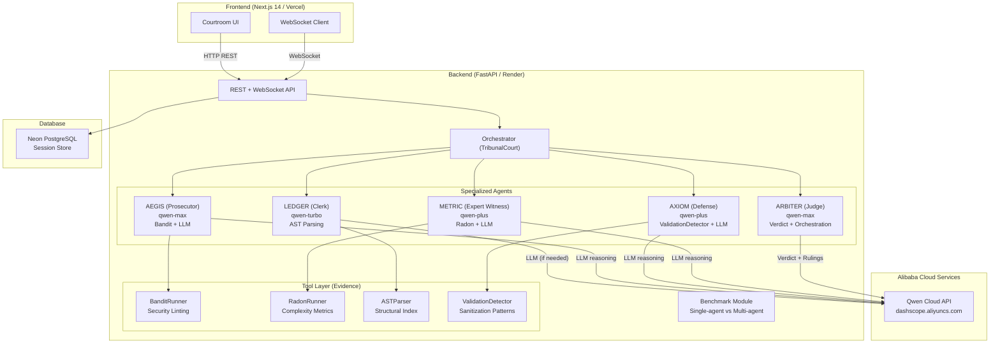
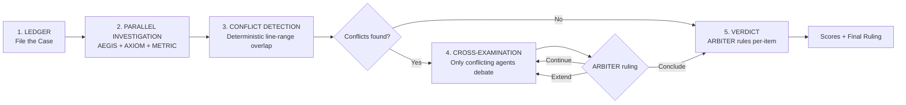

# CodeTribunal Architecture

## System Architecture Diagram

## Conditional Multi-Agent Protocol

## Data Flow

1. **User uploads code** -> LEDGER parses via AST/regex -> structural index stored in context
2. **Parallel investigation** -> Each agent runs its own tool (Bandit/Radon/ValidationDetector) -> structured AgentFinding objects
3. **Conflict detection** -> Deterministic line-range overlap algorithm (no LLM) -> ConflictCluster objects
4. **Cross-examination** (conditional) -> Only agents with conflicting findings debate -> agents can withdraw or revise confidence
5. **ARBITER procedural ruling** -> Dynamic decision: continue/conclude/extend debate rounds
6. **Verdict** -> Rubric-based deterministic scoring + LLM per-item ruling with reasoning trails

## Benchmark Comparison (Track 3 Requirement)

The `/benchmark/` endpoint runs both approaches on the same code:

| Dimension | Single-Agent Baseline | Multi-Agent Tribunal |
|-----------|----------------------|---------------------|
| LLM Calls | 1 | 5-12 (parallel + debate) |
| Tools Used | None | Bandit, Radon, AST, ValidationDetector |
| False Positives | Not filtered | Cross-examination withdraws weak claims |
| Scoring | LLM guesses from text | Deterministic rubric from structured findings |
| Coverage | Shallow, single perspective | Security + Performance + Maintainability |
