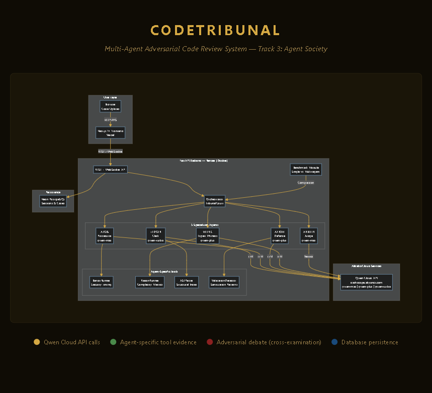

# CodeTribunal — Multi-agent Adversarial Code Review System

> Where every line of code faces justice

CodeTribunal is a multi-agent code review system that simulates a medieval courtroom where different AI agents take on roles to review code through adversarial debate. This project was developed for the Qwen Cloud Global AI Hackathon, Track 3: Agent Society.

## 🎯 Core Concept

CodeTribunal uses a unique **courtroom metaphor** where code undergoes adversarial review by five specialized agents:

| Agent | Role | Responsibility | Personality |
|-------|------|----------------|-------------|
| **AEGIS** | Prosecutor | Hunt security vulnerabilities, attack code weaknesses | Aggressive, adversarial |
| **ARBITER** | Judge / Orchestrator | Manage debate flow, resolve conflicts, issue final verdict | Neutral, authoritative |
| **AXIOM** | Defense | Defend valid code choices, provide context & counter-arguments | Analytical, protective |
| **METRIC** | Expert Witness | Provide performance data, complexity analysis, benchmarks | Data-driven, objective |
| **LEDGER** | Clerk | Record all proceedings, compile final report | Systematic, comprehensive |

## 🏗️ Tech Stack

### Backend
- **Language**: Python 3.11+
- **Framework**: FastAPI
- **Agent SDK**: Qwen Cloud API (qwen-max / qwen-plus / qwen-turbo)
- **Orchestration**: Custom debate loop
- **WebSocket**: FastAPI WebSocket (real-time debate streaming)
- **Deployment**: Render (Docker + Uvicorn)

### Frontend
- **Framework**: Next.js 14 (App Router)
- **Styling**: Tailwind CSS
- **Fonts**: Cinzel (headers/titles) + IM Fell English (body)
- **Real-time**: WebSocket client (native browser API)
- **Deployment**: Vercel

### Storage
- **Database**: Neon PostgreSQL (Serverless, session store + case persistence)

## 🚀 Quick Start

1. Clone the repository:
```bash
git clone https://github.com/einzeinn/codetribunal.git
cd codetribunal
```

2. Create and activate virtual environment:
```bash
python -m venv venv
source venv/bin/activate  # On Windows: venv\Scripts\activate
```

3. Install dependencies:
```bash
pip install -r requirements.txt
```

4. Set up environment variables:
```bash
cp .env.example .env
# Edit .env with your configuration
```

5. Run the backend:
```bash
cd backend
uvicorn main:app --reload
```

6. Run the frontend:
```bash
cd frontend
npm install
npm run dev
```

## 🏛️ Agent Interaction Protocol

```
[User uploads code]
        ↓
LEDGER: AST parse → structural case file (line count, imports, functions, classes)
        ↓
PARALLEL INVESTIGATION (asyncio.gather):
  AEGIS: Bandit security scan → tool-backed findings with clamped line ranges
  AXIOM: Validation pattern detection → defense evidence with AST proof
  METRIC: Radon complexity analysis → performance/complexity data
        ↓
CONFLICT DETECTION (deterministic, zero LLM calls):
  Line-range overlap analysis (±3 line tolerance) → cluster conflicting findings
        ↓
CROSS-EXAMINATION (conditional — only if conflicts exist):
  Only conflicting agents debate their specific clusters
  ARBITER issues procedural rulings: continue / conclude / extend
  Agent withdrawal at confidence < 0.3 resolves cluster immediately
  AEGIS tracks defeated findings across rounds (prevents re-arguing lost points)
        ↓
VERDICT (5-step pipeline):
  1. ARBITER LLM writes per-finding verdicts (CONFIRMED / DISMISSED / DISPUTED)
  2. Parse statuses from LLM response → mark AgentFinding objects
  3. Compute rubric scores respecting verdict status
     — CONFIRMED: 100% penalty, DISMISSED: 0% penalty, DISPUTED: 50% penalty
  4. Deterministic verdict from corrected scores
  5. Append score block to verdict text
        ↓
Final Ruling: APPROVED / APPROVED WITH CONDITIONS / REJECTED
```

## 📊 Debate Protocol Rules

1. **Filing** — LEDGER parses code via AST, strips trailing blanks, stores `total_lines` in context
2. **Parallel Investigation** — AEGIS, AXIOM, METRIC run concurrently with agent-specific tools
3. **Conflict Detection** — Deterministic line-range overlap (no LLM call, ±3 line tolerance)
4. **Cross-Examination** — Only conflicting agents debate their specific clusters
5. **ARBITER Procedural Ruling** — Dynamic decision: continue / conclude / extend debate
6. **Verdict Pipeline** — LLM writes verdicts → parse statuses → mark findings → compute scores → compute verdict
7. **Max rounds:** 3 + 1 possible ARBITER extension (prevent infinite loops)
8. **Early termination:** Agent withdrawal (confidence < 0.3) resolves cluster immediately

## 🔑 Key Architectural Decisions

### Verdict-First Scoring Pipeline
Scores are computed **after** the LLM writes per-finding verdicts, not before. This ensures dismissals directly affect the rubric:
- **CONFIRMED**: Full severity penalty (100%)
- **DISMISSED**: No penalty — excluded from scoring entirely (0%)
- **DISPUTED**: Half penalty — technically valid but mitigated context (50%)
- **Proportional floor**: If findings are dismissed, security score gets a minimum floor proportional to the dismissal ratio

### Agent Memory System
AEGIS receives a **DEFEATED FINDINGS** block each cross-exam round, listing findings it already lost. This prevents re-arguing defeated points and enables genuine learning within a session.

### Concession Rules
When AXIOM provides AST-level proof of non-usage (e.g., "subprocess is never called"), AEGIS MUST concede to confidence ≤ 0.2. The "mere presence suggests future misuse" argument is explicitly rejected against AST evidence.

### Line Range Integrity
- Bandit's `end_col_offset` (column offset) is NOT used as line end — actual line numbers are derived from `line_number` + code snippet analysis
- All line ranges are clamped to `total_lines` (stripped of trailing blanks)
- Reversed ranges (e.g., "lines 66-56") are auto-swapped

## 🎨 UI Aesthetic

- **Theme**: Dark medieval / parchment RPG courtroom
- **Fonts**: Cinzel (headers/titles) + IM Fell English (body)
- **Color palette**: Deep black `#0f0c05`, gold `#d4a843`, parchment `#e8d9b0`, muted `#9a7f4a`
- **Animations**: Streaming debate feed, live score bars, status badges

## 📁 Project Structure

```
CodeTribunal/
├── backend/           # FastAPI backend with agent orchestration
├── frontend/          # Next.js frontend with courtroom UI
├── requirements.txt   # Python dependencies
├── .gitignore        # Git ignore rules
└── README.md         # This file
```

## 🏆 Why This Wins Track 3

Track 3 (Agent Society) requirements addressed:
- Multiple agents with **distinct capabilities** and **agent-specific tools** (Bandit, Radon, AST, ValidationDetector)
- **Task decomposition**: parallel investigation with role-based specialization
- **Dialogue and negotiation**: cross-examination debate with confidence revision and withdrawal
- **Conflict resolution**: deterministic line-range overlap detection + per-cluster targeted debate
- **Dynamic orchestration**: ARBITER decides whether to continue, conclude, or extend debate rounds
- **Agent memory**: defeated findings tracked across rounds — agents learn from losses within a session
- **Adversarial integrity**: concession rules force honest acknowledgment when AST proof invalidates a finding
- **Verdict-status scoring**: CONFIRMED/DISMISSED/DISPUTED statuses directly affect rubric penalties, not just text
- **Measurable efficiency gain**: `/benchmark/` endpoint compares single-agent vs multi-agent side by side
- **Transparent scoring**: deterministic rubric-based scores from structured findings, not LLM guessing

## 📈 Benchmark: Single-Agent vs Multi-Agent

Run the comparison:
```bash
curl -X POST http://localhost:8000/benchmark/ \
  -H "Content-Type: application/json" \
  -d '{"code_content": "your code here", "language": "python"}'
```

| Metric | Single-Agent Baseline | Multi-Agent Tribunal |
|--------|----------------------|---------------------|
| Findings coverage | Shallow, 1 perspective | Deep: security + performance + maintainability |
| False positive filtering | None | Cross-examination with AST-backed concessions |
| Tool evidence | None | Bandit, Radon, AST, ValidationDetector |
| Scoring transparency | LLM guesses from text | Verdict-first pipeline: status → penalty → score |
| Agent memory | None | Defeated findings tracked across rounds |
| Debate rounds | N/A | Dynamic (ARBITER decides continue/conclude/extend) |

## 🤖 AI / Models

- **ARBITER**: qwen-max — complex orchestration & final verdict
- **AEGIS**: qwen-max — adversarial reasoning, sharp attack
- **AXIOM**: qwen-plus — counter-argument, lighter reasoning
- **METRIC**: qwen-plus — data analysis & complexity
- **LEDGER**: qwen-turbo — parsing & recording only

## 🏗️ Architecture Diagram



See [ARCHITECTURE.md](ARCHITECTURE.md) for the full system architecture, protocol flow, and data flow diagrams.

### Proof of Alibaba Cloud Service Usage

- **Backend Hosting**: Render (Docker + Uvicorn)
- **LLM API**: Qwen Cloud (Alibaba Cloud) via `https://dashscope.aliyuncs.com/compatible-mode/v1`
- **Models**: qwen-max, qwen-plus, qwen-turbo from Alibaba's Qwen family
- **Evidence**: See `backend/config.py` line 15 for `QWEN_BASE_URL` configuration

## 📄 License

MIT License - see the [LICENSE](LICENSE) file for details.